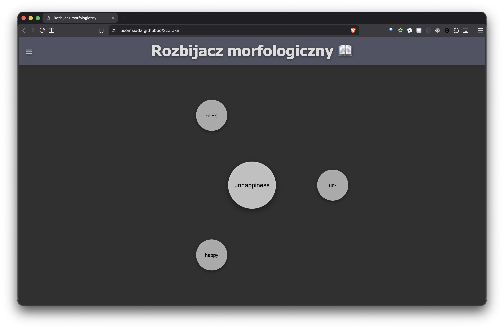
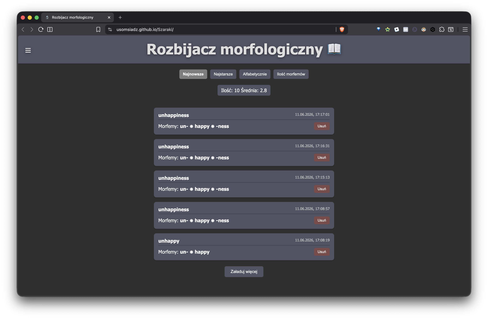
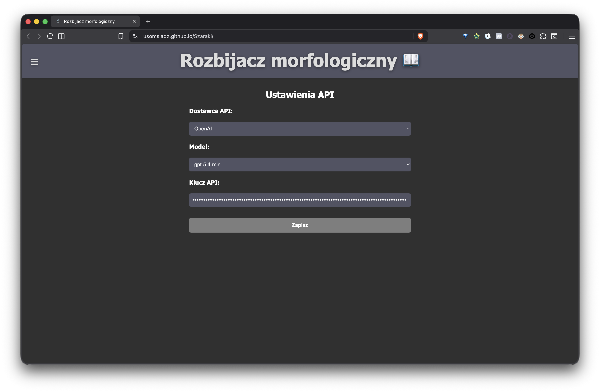

# Szaraki
# 1) Grupy
Hubert Parzych
Łukarz Kazimierczuk
Oliwia Łankiewicz
# 2)Lider
Hubert Parzych
# 3) Nazwa
Szaraki
# 4) Obszar
Nauka Ang. (Słowotwórstwo)
# 5)Github
https://github.com/USomsiadZ/Szaraki

# Dokumentacja
# Rozbijacz Morfologiczny

**Aplikacja online:** https://usomsiadz.github.io/szaraki/

Aplikacja webowa służąca do nauki języków oraz wizualnej analizy słowotwórczej. Projekt pozwala użytkownikowi wpisać dowolne słowo, które następnie za pomocą sztucznej inteligencji (LLM) jest rozbijane na poszczególne morfemy (prefiksy, rdzeń, sufiksy) i prezentowane w formie dynamicznych, rozsuwających się kulek na ekranie.

Projekt został zrealizowany w ramach przedmiotu **Wprowadzenie do aplikacji WWW**.

---

## Główne Funkcje

* **Morfologiczny Rozbiór Słów:** Integracja z wieloma dostawcami AI w celu dokładnego podziału wyrazów.
* **Dynamiczna Wizualizacja:** Prezentacja morfemów za pomocą animowanych elementów graficznych układających się w okrąg (tryb "Kulek").

* **Historia Wyszukiwań:** Przechowywanie historii zapytań w pamięci przeglądarki (`localStorage`) z zaawansowanymi opcjami sortowania:
    * Najnowsze / Najstarsze
    * Alfabetycznie
    * Ilość morfemów

* **Panel Ustawień:** Elastyczna konfiguracja wyboru dostawcy API (OpenAI, Gemini, Claude, OpenRouter), klucza autoryzacyjnego oraz modelu.

* **Responsywny Design:** Pełna adaptacja interfejsu do ekranów mobilnych, standardowych oraz monitorów Ultra-Wide (media queries).


---

## Architektura Projektu i Struktura Plików

Aplikacja została zbudowana w architekturze modułowej przy użyciu czystego JavaScriptu, gdzie widoki oraz komponenty są generowane dynamicznie za pomocą manipulacji drzewem DOM.

```text
Szaraki/
├── index.html              # Punkt wejścia, ładowanie skryptów i stylów
├── css/
│   └── styles.css          # Style całej aplikacji
├── img/                    # Grafiki interfejsu (favicon, autorzy, ikony)
├── dokumentacja_img/       # Screenshoty do README
└── js/
    ├── main.js             # Start aplikacji, routing między widokami
    ├── createStage.js      # Tworzenie kontenerów scen (main, historia, ustawienia, o nas)
    ├── page_header.js      # Nagłówek i menu hamburger
    ├── page_main.js        # Scena główna: kulki, animacje, zapytania do API
    ├── page_history.js     # Historia rozbić: sortowanie, paginacja, usuwanie, statystyki
    ├── page_settings.js    # Ustawienia API (dostawca, model, klucz)
    ├── page_about.js       # Widok „O nas” i formularz kontaktowy
    ├── api_openai.js       # Integracja z API OpenAI
    ├── api_gemini.js       # Integracja z API Google Gemini
    ├── api_claude.js       # Integracja z API Anthropic Claude
    └── api_openrouter.js   # Integracja z API OpenRouter