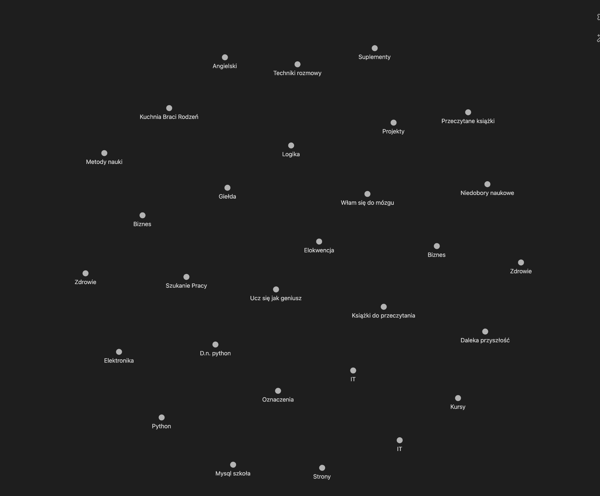

# Funkcjonalności
## 1.Program rozbija słówko na korzenie happiness -> happy-ness

Po kliknieciu na happy lub ness pokazuje obszerniejsze wytłumacznie
##### Przykładowy json z API 
```
{
"tłumaczenie": "szczęście",
"ipa": "ˈhæp.i.nəs",
"fonetyka_pl": "hæpi nes",
"przykłady": [
"Happiness is the key to a fulfilling life.",
"She found happiness in helping others."
],
"rozłożenie": "happy (szczęśliwy) + -ness (sufiks tworzący rzeczowniki od przymiotników)",
"część_mowy": "rzeczownik"
}
```
## 2. Program tworzy słowotwory dla danego słówka 
* happy -> {happiness, unhappiness, unhappy, happier, happiest, unhappier, unhappiest, happily, unhappily, happy-go-lucky}
* [Po kliknięciu przechodzi do funkcjonalności nr 1](#1program-rozbija-słówko-na-korzenie-happiness--happy-ness)



### Strona posiada także
- Możliwość wybrania dostawcy (Modelu LLM) po wpisaniu klucza
- Kulki(słowotwory) są dynamiczne


#Widoki
1 - Rozbicie słów
* Głownie tekstowy
2 - Tworzenie nowego słowotwora
* widok grafu